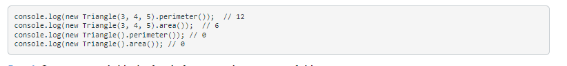

# Project 6

Learned that classes in Javascript are a template for creating objects. Gained expereince creating 
classes with different characteristics and properties. Practiced inheriting classes within one and other.
Gained more experience using a generic block of code to process data.

### Skills Used in Project
- Created 3 classes:
   - A Shape class that serves as a base for the other two
   - A Rectangle class that is inherited from Shape class
   - A Triangle class that is inherited from Shape class

- Tested classes using: 

- Used for..of and switch() to create a generic block of code that processes information from the classes,
and creating new objects from those classes

## To access code for project 
1. Scroll to the top and press "View on Github"
2. Click on the code folder in repo
